# Sesion 2 - Controladores avanzados: UIPageViewController, UICollectionViewController, UISearchContro

En esta sesión veremos otros controladores que son comunes en aplicaciones iOS: el controlador paginado \(`UIPageViewController`\), las colecciones \(`UICollectionViewController`\) y el controlador de búsqueda para tablas \(`UISearchController`\).

## UIPageViewController

El controlador paginado \(_UIPageViewController_\) sirve para poder cambiar entre varias páginas en pantalla que contienen información similar. Es una clase bastante configurable, ya que permite modificar:

* La orientación de las vistas de las páginas \(horizontal o vertical\).
* El estilo de transición \(_page-curl_ o _scrolling_\).
* Para la transición _page-curl_, la localización del eje.
* Para la transición _scrolling_, el espacio entre páginas.

La clase `UIPageViewController` se considera un controlador contenedor \(_container controller_\). Los controladores contenedores pueden usarse para almacenar y gestionar múltiples _view controllers_, y cambiar de uno a otro cuando sea necesario. Otros ejemplos de controladores contenedores son `UINavigationController`, `UITabBarController` y `UISplitViewController`.

XCode tiene una plantilla que usa como base este controlador, llamada _Page-Based Application_. Si creamos un nuevo proyecto con esta plantilla, veremos que la aplicación consiste en un libro donde podemos pasar las páginas.

Si vamos a implementar una app parecida a un libro, esta plantilla es útil. Pero si no es el caso \(y normalmente no lo es\), es mejor programar el controlador desde cero, ya que deberíamos hacer tantas modificaciones en la plantilla que no merecería la pena.

Es por esto que vamos a hacer una aplicación de ejemplo para ver las posibilidades de este controlador y cómo se programa.

## Ejercicio 1 - UIPageViewController

Esta aplicación tendrá 4 páginas que contienen información de ayuda. Los controladores paginados se suelen usar frecuentemente para esto. Nuestra app quedará del siguiente modo cuando la terminemos:

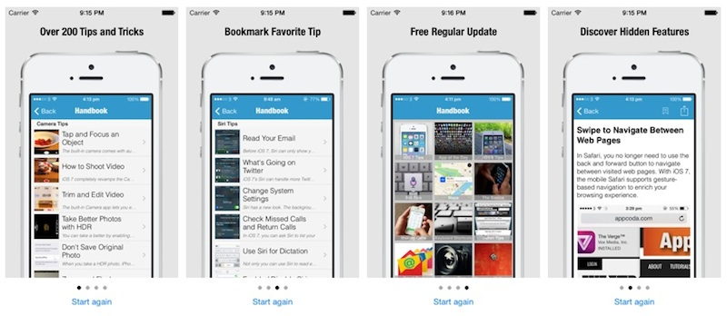

Para empezar vamos a crear un proyecto con la plantilla _Single View Application_, al que llamaremos `ejercicio_pageview`.

#### Creación de las vistas

Primero vamos a arrastrar un `UIPageViewController` al storyboard \(fuera de la primera vista\). Haremos lo mismo con otro `UIViewController` genérico, que es el que contendrá la información de las 4 pantallas. Usaremos la misma vista para las 4 pantallas porque en realidad su estructura es la misma. El controlador inicial del storyboard que viene por defecto también vamos a usarlo, para superponer sobre él el controlador paginado, como veremos más adelante.

Tenemos que asignar un identificador del storyboard para los dos vistas que hemos creado, de modo que podamos referenciarlas posteriormente desde nuestro código. Asigna el nombre `PageViewController` al controlador _Page View Controller_, y `PageContentViewController` al _UIViewController_.

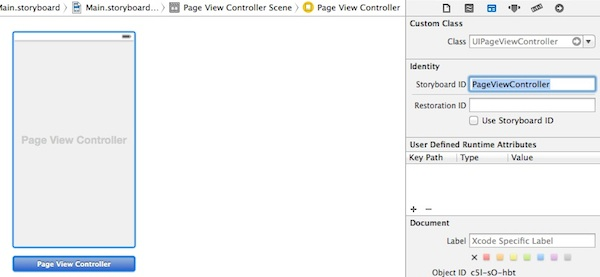

En el `PageViewController`, cambia el valor de transición de `Page Curl` a `Scroll`, ya que el primero queda bien para libros pero no para nuestra aplicación.

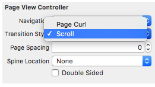

#### Implementación de la vista de contenido \(PageContentViewController\)

Vamos a diseñar primero la vista de contenido \(`PageContentViewController`\), que debería quedar de forma similar a la siguiente:

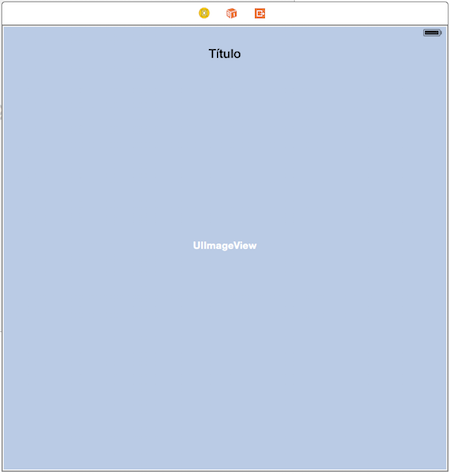

Tendremos un _label_ arriba \(pon la fuente en negrita\) y una imagen.

Ya tenemos la vista de contenido, pero nos hará falta un controlador para cambiarla dinámicamente. Crea un nuevo fichero con _File &gt; New File &gt; Cocoa Touch Class_, llámalo `PageContentViewController` y hazlo subclase de `UIViewController`, dejando desmarcado _Also create Xib_.

Volvemos al storyboard, nos situamos en el _PageContentViewController_ y asignamos el controlador a la vista:

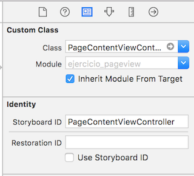

Enlazamos los _outlets_ de la imagen y la etiqueta al controlador. Llámalos del siguiente modo:

```swift
@IBOutlet weak var titulo: UILabel!
@IBOutlet weak var imageView: UIImageView!
```

Añade los siguientes atributos a los anteriores:

```swift
var pageIndex = 0
var titleText = ""
var imageFilename = ""
```

La variable pageIndex almacenará el índice de la página actual. Cambiamos también el método `viewDidLoad` para actualizar la imagen de fondo y el texto:

```swift
self.imageView.image = UIImage(named: self.imageFilename)
self.titulo.text = self.titleText
```

#### Implementación del primer controlador \(ViewController\)

Ya tenemos la vista de contenido. Vamos a modificar ahora la primera vista del storyboard, añadiendo un botón _Start again_, abajo y centrado:

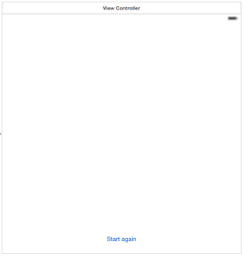

Crearemos una acción de este botón con `ViewController`. A este método lo que llamaremos `restart`.

#### Implementación del controlador paginado \(PageViewController\)

La estructura que vamos a seguir es la siguiente:

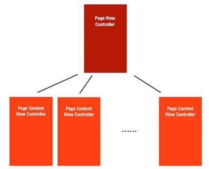

Por tanto, nuestro controlador paginado gestionará cuatro controladores de la misma clase.

Para usar este controlador, lo primero que tenemos que hacer es adoptar el protocolo `UIPageViewControllerDataSource`. El _data source_ es el responsable de gestionar los controladores de las vistas de contenidos cuando se le pidan, por lo que en los métodos de este protocolo indicaremos qué contenido mostrar para cada página.

En este ejemplo, usaremos la clase `ViewController` como _data source_ para la instancia de `UIPageViewController` que hemos creado. Es por esto que es necesario indicar que la clase `ViewController` implementa el protocolo `UIPageViewControllerDataSource`. Esta clase `ViewController` también será la responsable de proporcionar los datos de las páginas \(imágenes y títulos\).

Abre el fichero `ViewController.swift` y añade el delegado y estas tres propiedades \(el modelo de datos\):

```swift
class ViewController: UIViewController, UIPageViewControllerDataSource, UIPageViewControllerDelegate {

    let pageTitles = ["Over 200 Tips and Tricks", "Discover Hidden Features", "Bookmark Favorite Tip", "Free Regular Update"]
    let pageImages = ["page1.png", "page2.png", "page3.png", "page4.png"]

    var pageViewController : UIPageViewController?
```

Puedes descargar las imágenes que vamos a usar desde [aquí](https://github.com/mastermoviles/interfaz-de-usuario-en-dispositivos-moviles-ios-a/tree/b1925b63c84bda8abfc2ae116a76afb1d085e88d/sesion2_controladores_avanzados/pageview_images.zip), y añadirlas al proyecto.

Ya hemos creado el modelo de datos, pero nos falta implementar los métodos del protocolo `UIPageViewControllerDataSource`, que deben ser al menos estos dos:

* `viewControllerAfterViewController`: Aquí debemos indicar qué controlador mostrar en la siguiente página.
* `viewControllerBeforeViewController`: Aquí debemos indicar qué controlador mostrar en la página anterior.

Añade las siguientes líneas a `ViewController.swift`:

```swift
func viewControllerAtIndex(index : Int) -> PageContentViewController? {
      if self.pageTitles.count == 0 || index >= self.pageTitles.count {
              return nil;
      }

      // Crear un nuevo controlador de contenido y pasar los datos
      let pageContentViewController = self.storyboard?.instantiateViewController(withIdentifier: "PageContentViewController") as! PageContentViewController!

      pageContentViewController?.imageFilename = self.pageImages[index];
      pageContentViewController?.titleText = self.pageTitles[index];
      pageContentViewController?.pageIndex = index;

      return pageContentViewController;
  }

  func pageViewController(_ pageViewController: UIPageViewController, viewControllerBefore viewController: UIViewController) -> UIViewController? {

      let pvc = viewController as! PageContentViewController
      var index = pvc.pageIndex;

      if index == 0 || index == Foundation.NSNotFound {
          return nil
      }

      index -= 1
      return self.viewControllerAtIndex(index: index)
  }

  func pageViewController(_ pageViewController: UIPageViewController, viewControllerAfter viewController: UIViewController) -> UIViewController? {

      let pvc = viewController as! PageContentViewController
      var index = pvc.pageIndex;

      if index == Foundation.NSNotFound {
          return nil
      }

      index += 1
      if index == self.pageTitles.count {
          return nil
      }
      return self.viewControllerAtIndex(index: index)
  }
```

Como puedes ver, los métodos delegados de `pageViewController` son muy sencillos. Simplemente miramos el índice actual, lo incrementamos o decrementamos en función del método y devolvemos el controlador a mostrar.

El método `viewControllerAtIndex` es el que muestra el controlador indicado. Para ello, como puede verse, usamos la siguiente instrucción:

```swift
let pageContentViewController = self.storyboard?.instantiateViewController(withIdentifier: "PageContentViewController") as! PageContentViewController!
```

Recuerda que habíamos asignado un _storyboardID_ a los controladores. Este identificador lo hemos usado como referencia para crear las nuevas instancias, ya que si te fijas, `PageContentViewController` está suelto en el storyboard.

Ya lo tenemos casi. Para mostrar un indicador de página, tenemos que indicarle a iOS el número de páginas \(el número de puntos a mostrar\) y qué número de página se selecciona inicialmente. Añade los siguientes métodos al final de `ViewController.swift`:

```swift
func presentationCount(for pageViewController: UIPageViewController) -> Int {
    return self.pageTitles.count
}

func presentationIndex(for pageViewController: UIPageViewController) -> Int {
    return 0
}
```

> Si no se implementan estos métodos, no se mostrará el indicador de página

Por último, vamos a crear el controlador paginado. Lo haremos en el método `viewDidLoad` de `ViewController.swift`. Cámbialo por el siguiente:

```swift
override func viewDidLoad() {
    super.viewDidLoad()

    // Creamos el controlador paginado
    self.pageViewController = self.storyboard?.instantiateViewController(withIdentifier: "PageViewController") as! UIPageViewController?
    self.pageViewController?.dataSource = self
    self.pageViewController?.delegate = self;

    // Creamos el primer controlador de contenido
    let startingViewController = self.viewControllerAtIndex(index: 0)
    let viewControllers = [startingViewController!]

    self.pageViewController?.setViewControllers(viewControllers, direction: UIPageViewControllerNavigationDirection.forward, animated: false, completion: nil)

    // Cambiamos el tamaño para que quepa el botón de abajo
    self.pageViewController?.view.frame = CGRect(x: 0, y: 0, width: self.view.frame.size.width, height: self.view.frame.size.height-30)

    // Añadimos el primer controlador de contenido
    self.addChildViewController(self.pageViewController!)
    self.view.addSubview((self.pageViewController?.view)!)
    self.pageViewController?.didMove(toParentViewController: self)
}
```

En este método hemos creado una instancia de `PageViewController`. Después especificamos el _data source_ \(la fuente de datos\), que es la clase actual. Creamos el primer controlador de contenido, lo añadimos a un array de controladores, y lo asignamos al controlador de la página para mostrarlo.

Compilamos y ejecutamos. Debería funcionar, pero la vista sale descolocada debido a que falta ajustar las _constraints_. Para arreglarlo, seleccionamos el _PageContentViewController_ en el storyboard, y marcamos _Reset to suggested constraints_. Ejecutamos de nuevo y podemos ver que el contenido ya se muestra bien, aunque falta todavía el botón de abajo. Seleccionamos nuestro `ViewController` y marcamos de nuevo _Reset to suggested constraints_. Ahora sí que vemos el botón. Lo único que nos falta son los puntos de abajo, que están ahí pero que no se ven porque son del mismo color que el fondo. Vamos a cambiarles el color.

Abre el fichero `AppDelegate.swift`, y añade las siguientes líneas en `didFinishLaunchingWithOptions`:

```swift
let pageControl = UIPageControl.appearance()
pageControl.pageIndicatorTintColor = UIColor.lightGray
pageControl.currentPageIndicatorTintColor = UIColor.black
pageControl.backgroundColor = UIColor.white
```

Si se te "chafa" el botón de _Start again_, bájalo un poco en la vista, resetea de nuevo las _constraints_ y recompila.

Sólo nos falta la implementación de este botón para volver a la primera página. El método `restart` en `ViewController.swift` debería quedar de la siguiente manera:

```swift
@IBAction func restart(_ sender: AnyObject) {    
    let startingViewController = self.viewControllerAtIndex(index: 0)
    let viewControllers = [startingViewController!]
    self.pageViewController?.setViewControllers(viewControllers, direction: UIPageViewControllerNavigationDirection.reverse, animated: false, completion: nil)
}
```

Si ejecutamos de nuevo la aplicación, veremos que el botón ya funciona.

En este ejercicio hemos hecho la parte principal para usar un `UIPageViewController` en un storyboard. Se ha implementado la transición en _scroll_, pero este controlador es muy configurable y como hemos visto podemos incluso usarlo para hacer un libro.

## Ejercicio 2 - UICollectionViewController

Las colecciones pueden usarse como alternativa a las tablas cuando tenemos una distribución de los elementos de tipo rejilla \(_grid_\), por ejemplo.

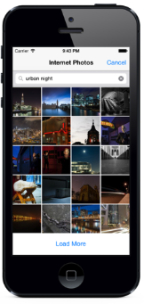 

Para implementar una colección es necesario indicar el número de secciones, el tamaño de las celdas, y especificar los contenidos de cada celda. El controlador de la colección automáticamente reorganizará las posiciones de las celdas en función de su tamaño y del tamaño de la pantalla.

### Ejemplo UICollectionViewController

Vamos a hacer un ejercicio sencillo para ver cómo funciona. Crearemos un proyecto llamado `ejercicio_collection`, de tipo _Single View_.

Arrastramos al storyboard \(fuera de la vista que viene por defecto\) un nuevo `UICollectionViewController`, y movemos en el storyboard la flecha que apunta al controlador inicial para que ahora este sea nuestro `UICollectionViewController`. Borramos `ViewController.swift`, y creamos un nuevo controlador con _New &gt; File &gt; Cocoa Touch_. Lo llamaremos `CollectionViewController`, subclase de `UICollectionViewController`, dejando desmarcado _Also create Xib_.

En el storyboard, seleccionamos nuestra vista e indicamos cuál va a ser el controlador:

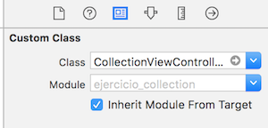

#### Creación de las celdas

En la vista de `UICollectionViewController` veremos un rectángulo en la parte superior izquierda, que se corresponde con una celda. Vamos a crear una clase propia para las celdas, de forma que podamos configurarlas para darles el aspecto que queramos. El procedimiento es similar al que hicimos para las celdas personalizadas.

Creamos una nueva clase llamada `CollectionViewCell`, subclase de `UICollectionViewCell`, y desmarcando _Also create XIB_.

En el storyboard, seleccionamos la celda que hay dentro de nuestro controlador de colecciones, y cambiamos la clase `UICollectionViewCell` por la que hemos creado, `CollectionViewCell`.


En la pestaña de _Attributes Inspector_ escribimos el identificador **IdCelda** para nuestras celdas.

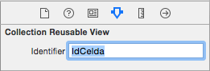

Seleccionamos la ventana de _Collection View Controller_, y en el _Size inspector_ cambiamos el tamaño de las celdas \(_Cell Size_\) a 100 x 100 puntos.

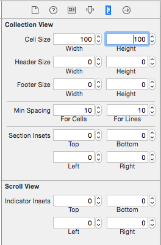

Como puede verse, tenemos más atributos que podríamos cambiar, como el tamaño de la cabecera y pie, el espaciado entre celdas, o los _insets_, que se pueden usar para crear bordes alrededor de las celdas.

También tenemos que cambiar el tamaño de la celda, seleccionando en el storyBoard nuestro _IdCelda_:

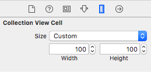

En este ejercicio configuraremos las celdas para que muestren una imagen. Para ello, desde el _Interface Builder_ arrastramos un `UIImageView` a la celda, de forma que ocupe todo su tamaño. Crearemos un outlet de la imagen en nuestra celda personalizada y lo llamamos `imageView`.

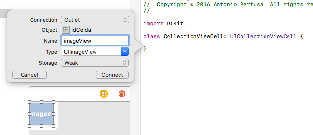

Ya tenemos la vista preparada, sólo falta añadir los datos.

#### Configurar los datos

Nos queda configurar el _data source_, es decir, implementar los métodos delegados de `UICollectionViewDataSource` para mostrar los datos de las celdas. Abre el fichero `CollectionViewController.swift`, y mira los métodos de la sección `UICollectionViewDataSource`. Como puedes ver, nuestra clase debe implementar:

* `numberOfSections`. Como en una tabla, debemos indicar el número de secciones. Este método es opcional, y si no lo implementamos se asumirá una sóla sección.
* `numberOfItemsInSection`. Aquí indicaremos la cantidad de items \(celdas\) para cada sección.
* `cellForItemAt`: Como en una tabla, en este método indicaremos el contenido de cada celda.

> Si quieres más información sobre los métodos de un protocolo o de cualquier clase Cocoa, en la vista de código de XCode puedes pinchar sobre el nombre del mismo con _Alt+click_ para ver la ayuda, o con _Command+click_ para ver su declaración \(aunque esto último no suele servir de ayuda\).

Vamos a crear los datos de nuestra aplicación. Descarga [este](https://github.com/mastermoviles/interfaz-de-usuario-en-dispositivos-moviles-ios-a/tree/b1925b63c84bda8abfc2ae116a76afb1d085e88d/sesion2_controladores_avanzados/collectionview_image_pack.zip) fichero con imágenes, y añádelas todas al proyecto. Crearemos un array para almacenarlas:

```swift
var foodImages = [String]()
```

Inicializamos el array al final del método `viewDidLoad` de `CollectionViewController`.

```swift
for i in 1..<17 {
    let image = "\(i).jpg"
    self.foodImages.append(image)
}
```

> Para un bucle _for_ lo normal es usar fast enumeration, pero en casos como este \(cuando tenemos rangos\) podemos usar el estilo anterior

Modificamos los métodos delegados desde `CollectionViewController`:

```swift
override func collectionView(_ collectionView: UICollectionView, numberOfItemsInSection section: Int) -> Int {
    return self.foodImages.count
}

override func collectionView(_ collectionView: UICollectionView, cellForItemAt indexPath: IndexPath) -> UICollectionViewCell {
    let cell = collectionView.dequeueReusableCell(withReuseIdentifier: "IdCelda", for: indexPath) as! CollectionViewCell

    // Configure the cell
    if let image = UIImage(named:self.foodImages[indexPath.row]) {
        cell.imageView.image = image
    }
    return cell
}
```

Podemos comentar el método `numberOfSections`, ya que su implementación no es obligatoria.

Si ejecutamos la aplicación en el simulador, veremos algo como esto:

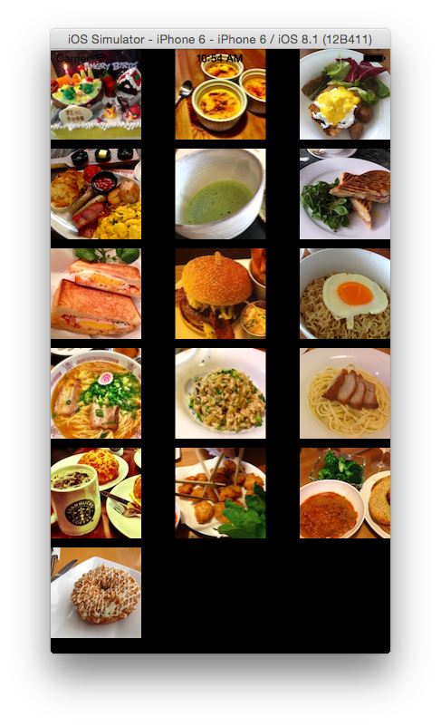

Y en landscape podemos ver cómo se adapta:

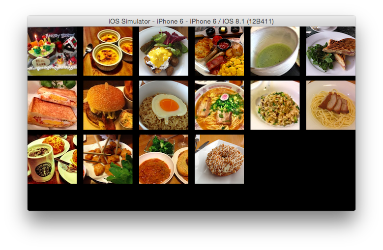

Evidentemente, no queda muy bien que las imágenes estén tan pegadas a los bordes. Vamos a cambiar esto con los _insets_, desde las propiedades de la colección:

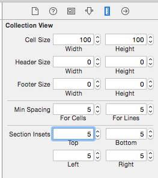

Como puedes ver, ahora queda algo mejor. Desde código también podemos jugar con los tamaños de los bordes cambiando los atributos del controlador en función del dispositivo, pero para este ejemplo no es necesario. Además podríamos hacer que cuando se pulse una imagen se mostrara una vista de la misma a pantalla completa, aunque tampoco lo implementaremos en este ejercicio.

## Ejercicio 3 - Controlador de búsqueda

En las aplicaciones iOS es común encontrar una barra de búsqueda en asociada a una tabla en la que se muestran los resultados de la búsqueda. Este comportamiento estándar se definía, hasta _iOS7_, con la clase `UISearchDisplayController`. Este controlador era bastante complejo, por lo que _Apple_ decidió cambiarlo en _iOS7_ por `UISearchController`. Vamos a ver cómo se implementa este último, ya que es bastante más sencillo, aunque aun así no es trivial.

### Ejemplo de controlador de búsqueda

Crea una aplicación _universal_ con el nombre `ejercicio_search` usando la plantilla `Master-detail`. Lo hacemos desde esta plantilla simplemente para tener una tabla ya construida sobre la que aplicaremos el controlador de búsqueda.

En `MasterViewController`, cambia la declaración del array:

```swift
var objects = [String]()
```

A continuación borra el método `insertNewObject`, y deja `viewDidLoad` así:

```swift
override func viewDidLoad() {
    super.viewDidLoad()
    // Do any additional setup after loading the view, typically from a nib.

    self.objects = ["En", "un", "lugar", "de", "la", "mancha", "de", "cuyo", "nombre"]

    if let split = self.splitViewController {
        let controllers = split.viewControllers
        self.detailViewController = (controllers[controllers.count-1] as! UINavigationController).topViewController as? DetailViewController
    }
}
```

En `prepare(for segue`, sustituye la línea donde aparece `NSDate` por esta otra \(en realidad es como debería ser en la plantilla por defecto para que ésta fuera genérica, pero _Apple_ no lo ha considerado así\):

```swift
let object = self.objects[indexPath.row]
```

Y lo mismo en `cellForRowAtIndexPath`:

```swift
let object = objects[indexPath.row]
```

Por último, en `DetailViewController` sustituye `NSDate` por `String`:

```swift
var detailItem: String? {
```

Si ejecutamos la aplicación veremos que ya tenemos una tabla y una vista detalle. Vamos a centrarnos en la tabla, a la que añadiremos un controlador de búsqueda.

**Antes de** _**iOS7**_, esto se hacía arrastrando un objeto de tipo _Search Bar and Search Display Controller_ al principio de la tabla desde el _Interface Builder_. La gestión de esto era algo complicada, ya que teníamos varias conexiones que debíamos gestionar manualmente.

**Ahora**, _Search Display Controller_ es un controlador _deprecated_ \(obsoleto\), y _Apple_ recomienda usar la clase _UISearchController_ introducida en _iOS7_. Paradójicamente, esta clase no está en el _Interface Builder_, y sólo podemos usarla mediante código, pero simplifica bastante el procedimiento. Es de esta forma como vamos a hacerlo en nuestro ejemplo.

Primero, debemos crear nuestro _searchController_, y un array _searchResults_ que contendrá los resultados filtrados de la búsqueda. Al principio del fichero `MasterViewController` declararemos las siguientes variables \(privadas, ya que no hace falta acceder a ellas desde fuera de la clase\):

```swift
private var searchController : UISearchController?
private var searchResults = [String]()
```

En el método `viewDidLoad` de `MasterViewController` creamos la barra de búsqueda y la inicializamos. Añadimos lo siguiente al final del método:

```swift
// Creamos una tabla alternativa para visualizar los resultados cuando se seleccione la búsqueda
let searchResultsController = UITableViewController(style: .plain)
searchResultsController.tableView.dataSource = self
searchResultsController.tableView.delegate = self

// Asignamos esta tabla a nuestro controlador de búsqueda
self.searchController = UISearchController(searchResultsController: searchResultsController)
self.searchController?.searchResultsUpdater = self        

// Especificamos el tamaño de la barra de búsqueda
if let frame = self.searchController?.searchBar.frame {
    self.searchController?.searchBar.frame = CGRect(x: frame.origin.x, y: frame.origin.y, width: frame.size.width, height: 44.0)
}

// La añadimos a la cabecera de la tabla
self.tableView.tableHeaderView = self.searchController?.searchBar

// Esto es para indicar que nuestra vista de tabla de búsqueda se superpondrá a la ya existente
self.definesPresentationContext = true
```

Ahora tendremos que cambiar los métodos del protocolo _UITableViewDataSource_ que ya teníamos, que son _numberOfRowsInSection_ y _cellForRowAtIndexPath_. Esto lo haremos porque en función de si está o no activa la barra de búsqueda tendremos que mostrar una información u otra. Si la vista de la tabla es la dada por el controlador de búsqueda, tendremos que usar los elementos de la lista filtrada. En caso contrario, los de la lista principal.

```swift
override func tableView(_ tableView: UITableView, numberOfRowsInSection section: Int) -> Int {
    let src = self.searchController?.searchResultsController as! UITableViewController

    if tableView == src.tableView {
        return self.searchResults.count
    }
    else {
        return self.objects.count
    }
}

override func tableView(_ tableView: UITableView, cellForRowAt indexPath: IndexPath) -> UITableViewCell {
    let cell = tableView.dequeueReusableCell(withIdentifier: "Cell", for: indexPath)

    let src = self.searchController?.searchResultsController as! UITableViewController
    let object : String?

    if tableView == src.tableView {
        object = self.searchResults[indexPath.row]
    }
    else {
        object = objects[indexPath.row]
    }

    cell.textLabel!.text = object?.description
    return cell
}
```

Añade el protocolo de la barra de búsqueda a la clase `MasterViewController`. Este protocolo se llama `UISearchResultsUpdating`. A continuación tenemos que crear el método delegado para actualizar los datos de la tabla cuando el usuario modifique el texto de búsqueda. Añade el siguiente código:

```swift
func updateSearchResults(for searchController: UISearchController) {
    // Cogemos el texto introducido en la barra de búsqueda
    let searchString = self.searchController?.searchBar.text


    // Si la cadena de búsqueda es vacía, copiamos en searchResults todos los objetos
    if searchString == nil || searchString == "" {
        self.searchResults = self.objects
    }
    // Si no, copiamos en searchResults sólo los que coinciden con el texto de búsqueda
    else {
        let searchPredicate = NSPredicate(format: "SELF BEGINSWITH[c] %@", searchString!)
        let array = (self.objects as NSArray).filtered(using: searchPredicate)
        self.searchResults = array as! [String]
    }

    // Recargamos los datos de la tabla
    let tvc = self.searchController?.searchResultsController as! UITableViewController
    tvc.tableView.reloadData()

    // Deseleccionamos la celda de la tabla principal
    if let selected = tableView.indexPathForSelectedRow {
        tableView.deselectRow(at:selected, animated: false)
    }
}
```

Si ejecutamos el programa veremos que casi lo tenemos listo. El único pequeño problema es que fallará estrepitosamente cuando se pulse sobre la barra de búsqueda.

Para arreglar este error, debemos asignar el prototipo de la celda del storyboard. En `CellForRowAtIndexPath` sustituye la siguiente línea:

```swift
let cell = tableView.dequeueReusableCell(withIdentifier: "Cell", for: indexPath)
```

Por esta otra:

```swift
let cell = self.tableView.dequeueReusableCell(withIdentifier: "Cell", for: indexPath)
```

Este cambio también habría que hacerlo si usáramos un controlador antiguo \(_Search display controller_\). Si ejecutas de nuevo, la barra de búsqueda debe funcionar \(aparece un teclado y es funcional\). Sin embargo, todavía nos faltaría cambiar la vista detalle cuando se selecciona un elemento filtrado desde la vista maestra. Para ello tendremos que modificar el siguiente método:

```swift
override func prepare(for segue: UIStoryboardSegue, sender: Any?) {
    if segue.identifier == "showDetail" {
        let object : String

        if let indexPath = self.tableView.indexPathForSelectedRow {
             object = self.objects[indexPath.row]
        }
        else {
            let sc = self.searchController?.searchResultsController as! UITableViewController
            object = self.searchResults[(sc.tableView.indexPathForSelectedRow?.row)!]
        }
        let controller = (segue.destination as! UINavigationController).topViewController as! DetailViewController
        controller.detailItem = object
        controller.navigationItem.leftBarButtonItem = self.splitViewController?.displayModeButtonItem
        controller.navigationItem.leftItemsSupplementBackButton = true
    }
}
```

Como puede verse, dependiendo de si la búsqueda está seleccionada o no, este método asigna una fuente de datos u otra para mostrarla en la vista detalle.

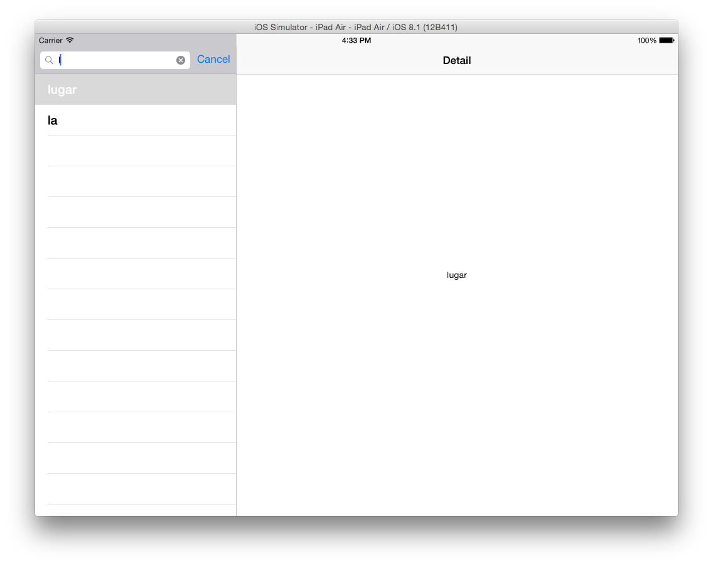

Esto es lo básico para crear una barra de búsqueda asociada a una tabla. Como puedes ver, el diseño de Cocoa podría ser más sencillo pero tampoco es es demasiado complicado, sobre todo si lo comparamos con cómo se hacía antes de iOS7.

