# Sesion 3 - Componentes para iPad y aplicaciones universales

En esta primera parte empezaremos explicando distintos componentes de diseño de interfaz de usuario para iOS. Comenzaremos con el funcionamiento de los controladores que se desarrollaron específicamente para iPad \(aunque ahora también se usan en los iPhone con pantallas grandes\), y daremos una serie de guías para programar aplicaciones universales, que son las compatibles tanto con iPhone como con iPad.

## Componentes para iPad

Debido a las diferencias evidentes de tamaño entre un iPhone y un iPad \(al menos hasta el lanzamiento del _iPhone 6_\), Apple desarrolló una API específica para iPad. La intención era que aquellas aplicaciones para iPad se beneficiaran de esta API para mejorar la experiencia de usuario y la usabilidad. Por ello aparecieron dos nuevos controladores enfocados a esta plataforma:

* **Popover**: Es una ventana emergente que puede aparecer en cualquier parte de la pantalla, normalmente junto a un botón al pulsarlo. Resulta muy útil para mostrar un listado de opciones o una tabla con información sin llegar a ocultar toda la pantalla.
* [**Split View**](https://developer.apple.com/reference/uikit/uisplitviewcontroller) \(Vista dividida\): Está formado por dos vistas independientes, una situada en la parte izquierda y otra en la parte derecha. Se utiliza frecuentemente para mostrar en la izquierda un listado de opciones en forma de tabla, y en la derecha el detalle de lo seleccionado en la parte izquierda. El _Split View_ normalmente se usa en la primera pantalla de la aplicación \(como controlador raíz\). A pesar de que puede usarse en una vista intermedia no es recomendable hacerlo, y además Apple no permite incrustar este controlador en otro controlador contenedor como un `UINavigationController`. Cuando creamos un nuevo proyecto con la plantilla `Master Detail Application` se genera la estructura básica para una aplicación Universal \(por defecto\) usando el controlador `UISplitView Controller` como base.

> En versiones anteriores a iOS sólo estaba permitido usar _Split Views_ en iPad. Desde iOS 8.0 y coincidiendo con la aparición de los modelos con pantallas de mayor tamaño, se puede usar _Split Views_ en todos los dispositivos iOS, aunque la vista dividida sólo puede verse en _iPad_, _iPhone plus_ y _iPhone X_.

En este tema veremos cómo implementar _popovers_ y _Split Views_ para hacer apps universales.

## Popovers

### Introducción

Un _popover_ es una ventana secundaria \(estilo _popup_\) que aparece por encima de la ventana principal de la interfaz. Se puede programar para que desaparezca automáticamente cuando el usuario toca cualquier parte de la pantalla.

El tamaño del _popover_ se puede modificar y por supuesto puede contener casi cualquier vista que se desee, como por ejemplo un listado de opciones de configuración, un álbum de fotos del que el usuario pueda seleccionar una, un formulario simple para introducir un texto, etc. En un iPhone, un _popover_ de iPad puede corresponderse con cualquier vista que ocupe la pantalla completa.

En iOS 9 Apple cambió la forma de crear popovers debido a la inclusión de _multitasking_ en iPad, que permite ejecutar dos aplicaciones simultáneas que comparten la pantalla. Por tanto, en lugar de usarse la antigua clase `UIPopoverController` ahora se utiliza `UIPopoverPresentationController`, que tiene bastantes ventajas respecto a la anterior.

Con el fin de aclarar la definición de _popover_ y ver cómo podemos utilizarlo en nuestras aplicaciones vamos a realizar un sencillo ejercicio para mostrar un _popover_ que contiene un pequeño listado de opciones.

## Ejercicio 1 - Popovers

Creamos un nuevo proyecto de tipo _Single View_ llamado `ejercicio_popover`. Para empezar nos iremos al storyboard y pondremos la vista principal dentro de un `UINavigationController` con _Editor-&gt;Embed in-&gt;Navigation controller_.

Añadimos un botón \(`UIBarButtonItem`\) en la parte derecha de nuestra barra de navegación del `View Controller`. Le daremos el título `Opciones`. La idea es que cuando se seleccione este botón aparezca un _popover_ que mostrará una tabla.

Crea una acción llamada `accionOpciones` en `ViewController.swift`, que se active cuando se pulse el botón. De momento dejaremos este método vacío, ya que todavía no tenemos la vista a mostrar.

### Creando el controlador a mostrar

Para la vista del popover vamos a crear un controlador pulsando en _File &gt; New &gt; File &gt; Cocoa Touch Class_. Le daremos el nombre _TableViewController_, subclase de `UITableViewController` con la opción _Also create XIB_ desmarcada.

Arrastra un componente `UITableViewController` al storyboard, e indica que su controlador va a ser nuestro recien creado `TableViewController`. Dale también un nombre al _Storyboard ID_ \(llámalo _tablaStoryboard_\) y marca la opción _Use Storyboard ID_, como puede verse en la siguiente imagen. Esto lo hacemos para poder referenciar la vista desde cualquier punto de nuestro código.

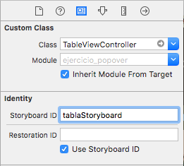

En la pestaña de _Attributes Inspector_ de la celda escribimos un identificador para ella: _TableViewCell_.

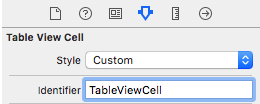

Ahora vamos a configurar el controlador que se verá en el _popover_, es decir, la tabla a mostrar cuando se pulse el botón. Para ello editamos `TableViewController.swift` con el siguiente código:

```swift
protocol TableViewControllerDelegate {
    func opcionSeleccionada(nombreOpcion : String)
}
```

Y añadimos dos variables en esta misma clase:

```swift
var opciones : [String]?
var delegate:TableViewControllerDelegate?
```

Ahora modificamos el método `viewDidLoad`:

```swift
override func viewDidLoad() {
    super.viewDidLoad()

    self.clearsSelectionOnViewWillAppear = false
    self.opciones = ["Opción 1", "Opción 2", "Opción 3"]
}
```

Y los métodos delegados de la tabla:

```swift
override func numberOfSections(in tableView: UITableView) -> Int {
    return 1
}

override func tableView(_ tableView: UITableView, numberOfRowsInSection section: Int) -> Int {
    return self.opciones!.count
}

override func tableView(_ tableView: UITableView, didSelectRowAt indexPath: IndexPath) {
    if self.delegate != nil {
        let opcion = self.opciones?[indexPath.row]

        // Llamamos al método opcionSeleccionada del delegado cuando se selecciona una opción de la tabla.
        self.delegate?.opcionSeleccionada(nombreOpcion: opcion!)
    }
}

override func tableView(_ tableView: UITableView, cellForRowAt indexPath: IndexPath) -> UITableViewCell {
    let cell = tableView.dequeueReusableCell(withIdentifier: "TableViewCell", for: indexPath)

    cell.textLabel?.text = self.opciones?[indexPath.row]

    return cell
}
```

Como puedes ver, se trata de un controlador de tabla que muestra tres opciones por pantalla. Cuando se seleccione una opción, se llamará al método `opcionSeleccionada` de la clase delegada, que será quien tome las decisiones necesarias con la opción elegida.

### Mostrando el popover

Una vez hemos programado la clase encargada de gestionar la selección de la opción, sólo nos queda mostrar esta tabla en un _popover_. Para ello abrimos `ViewController.swift` y hacemos que adopte los protocolos `UIPopoverPresentationController` \(por ser un popover\) y `TableViewControllerDelegate` \(para poder hacer algo cuando se seleccione una opción de la tabla\):

```swift
class ViewController: UIViewController, UIPopoverPresentationControllerDelegate, TableViewControllerDelegate
```

Ahora tenemos que programar el método que se invocará cuando se pulse sobre el botón en `ViewController.swift`:

```swift
@IBAction func accionOpciones(_ sender: Any) {
    let storyboard = UIStoryboard(name: "Main", bundle: nil)
    let controller = storyboard.instantiateViewController(withIdentifier: "tablaStoryboard") as! TableViewController

    controller.delegate = self

    // Presentamos el controlador
    // - en iPad, será un Popover
    // - en iPhone, será un action sheet
    controller.modalPresentationStyle = UIModalPresentationStyle.popover

    self.present(controller, animated: true, completion: nil)

    // Configuramos el popover (sí, después de presentarlo, es tan ilógico como parece)
    let popController = controller.popoverPresentationController

    // Todo popover debe tener un botón de referencia o una posición en la pantalla desde la que sale (con barButtonItem o con sourceView):
    popController?.barButtonItem = self.navigationItem.rightBarButtonItem
    popController?.permittedArrowDirections = UIPopoverArrowDirection.any
    popController?.delegate = self
}
```

Mira bien la lógica del método. Cuando se pulsa el botón en el método `accionOpciones`, cargamos el controlador de la tabla desde el _storyboard_. A continuación indicamos que la tabla delegará en nuestra clase para que nos avise de la selección mediante el método `opcionSeleccionada`. Después presentamos el controlador, y a continuación \(es raro pero es así, se hace después\) lo configuramos.

Tenemos que indicar desde qué botón parte el popover. En nuestro caso es el botón derecho de la barra de navigación, aunque también se puede indicar cualquier vista en lugar de un botón. Finalmente indicamos que el _popover_ delegará en nuestro controlador.

Ahora sólo nos queda implementar el método `opcionSeleccionada` en `ViewController.swift`:

```swift
func opcionSeleccionada(nombreOpcion: String) {
    // Comprobamos que se recibe aquí la opción seleccionada. Aquí ya podríamos hacer lo que queramos con el valor recibido.
    print("Seleccionado \(nombreOpcion)")

    // Ocultamos el popover
    self.dismiss(animated: true, completion: nil)
}
```

Compila y ejecuta el programa en un iPad. Cuando pulsamos fuera de la tabla, el popover desaparece, y si pulsamos en una opción podremos ver \(por `print`\) la opción pulsada. También verás que el popover es un poco grande para el contenido que muestra. Podemos cambiar su tamaño añadiendo la siguiente línea en `accionOpciones`, justo después de asignar `controller?.delegate = self`:

```swift
controller.preferredContentSize = CGSize(width: 250, height: 135)
```

Vuelve a ejecutar el programa y verás como el tamaño del popover es más adecuado. Prueba también a ejecutar la aplicación en un _iphone 5S_. Verás que el comportamiento de la tabla es como el de un _action sheet_ a pantalla completa.

Como puedes ver, en la última línea del método `accionOpciones` hemos indicado que el delegado del popover \(para el protocolo `UIPopoverPresentationControllerDelegate`\) es nuestra clase. Sin embargo, no hemos implementado ningún método de este protocolo por lo que esta línea podríamos eliminarla y seguiría funcionando correctamente. No obstante, en caso de que quisiéramos realizar alguna acción cuando el popover desaparezca, tendríamos que usar el protocolo `UIPopoverPresentationControllerDelegate`, que tiene métodos para acciones de cancelación o de movimiento en pantalla del popover, como por ejemplo `popoverPresentationControllerDidDismissPopover` o `popoverPresentationControllerShouldDismissPopover`.

## Split View

Un **Split View** o _Vista divida_ es, como hemos comentado anteriormente, una combinación de dos vistas, una maestra y una detalle.

En modo horizontal \(_landscape mode_\), la primera vista \(maestra\) es equivalente en anchura a una vista de iPhone cuando se encuentra en orientación vertical. Esta vista maestra se suele usar para la navegación principal dentro de un listado de opciones de la aplicación. Por otro lado, la vista de la derecha \(detalle\), que corresponderá a la porción más grande de la pantalla, mostrará la información en detalle que hayamos seleccionado en la vista de la izquierda. Este es el uso que Apple propone para este tipo de controlador, aunque puede tener muchos más.

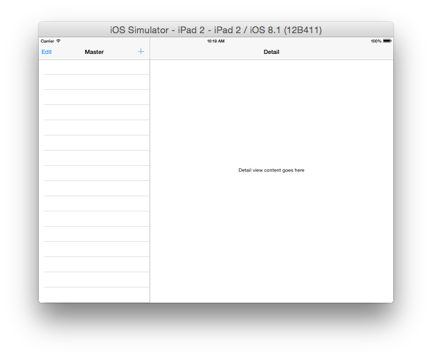

En modo vertical \(_portrait mode_\), el _Split View_ cambia y puede verse como un _Navigation Bar_ con dos vistas. La primera es la vista maestra, y la segunda la vista detalle. Esta transformación hace falta programarla si no hacemos uso de las plantillas de XCode. Por tanto, sólo una de las vistas ocupará toda la pantalla del iPad, como podemos ver en la siguiente imagen:

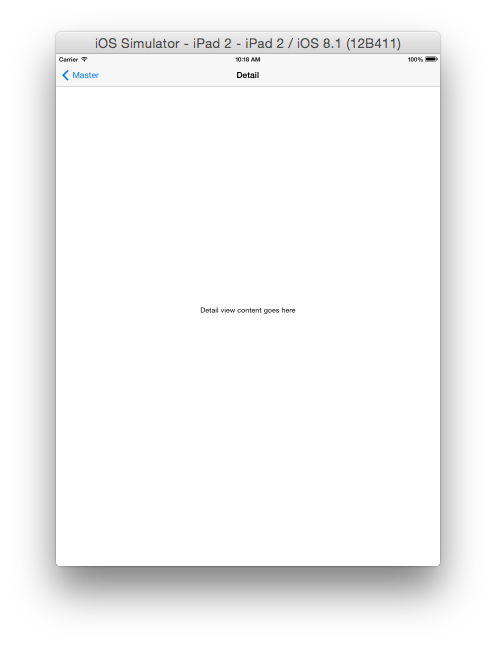

Incorporar un controlador _Split View_ a nuestra aplicación es bastante sencillo aunque no es trivial. Es por ello que vamos a explicarlo con una app de ejemplo que mostrará información sobre tablets. En modo horizontal \(_landscape_\) tendremos un listado en forma de tabla con todos los tablets en la parte izquierda del _Split View_ y cuando seleccionemos uno nos aparecerán sus detalles en la parte derecha.

## Aplicaciones universales

En este apartado trataremos las **aplicaciones universales**, veremos qué son, qué ventajas e inconvenientes podemos encontrar a la hora de diseñarlas, cómo programarlas y las recomendaciones de uso por parte de Apple. Y vamos a hacerlo usando un controlador de tipo _Split View_ como base.

### Introducción

Utilizamos el término **universal** para denominar a todas aquellas aplicaciones adaptadas tanto al iPad como al iPhone. Los usuarios agradecen este tipo de aplicaciones ya que pueden hacer una sóla compra y usarla en todos sus dispositivos, y además cuanto mayor sea el número de dispositivos compatibles más clientes potenciales captaremos.

El desarrollo de una aplicación universal ahorra tiempo de desarrollo respecto a hacer apps independientes para cada dispositivo, ya que evidentemente programaremos un sólo proyecto en lugar de varios. También tiene ventajas para las actualizaciones, ya que tendremos que preocuparnos de implementar los cambios sólo en una aplicación.

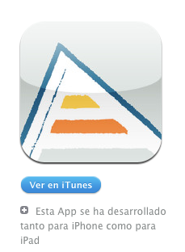

A partir de XCode 4.2 podemos crear desde cero aplicaciones universales usando cualquier plantilla de las disponibles, entre las que destaca la plantilla `Master Detail`, que emplea un controlador de tipo `Split View`.

### Diseñando la interfaz de una aplicación universal

El primer paso que debemos realizar para hacer una aplicación universal desde cero es diseñar la interfaz para cada una de las vistas. En versiones anteriores de iOS se separaba por un lado las de iPhone de las de iPad usando distintos ficheros _.xib_, aunque ahora se debe hacer de forma conjunta usando los _storyboards_. A continuación detallaremos algunos de los puntos que debemos tener en cuenta a la hora de diseñar una interfaz universal:

* **Orientación.** Con la información sobre la orientación del dispositivo podremos adaptar la interfaz de la aplicación para acomodarla al mismo en un momento dado. En aplicaciones para iPhone, la adaptación de la interfaz no es tan importante como en aplicaciones para iPad. Haciendo uso de esta funcionalidad mejoraremos considerablemente la experiencia de usuario.
* **Estructura de las vistas**. La pantalla del iPad, al ser más grande que la del iPhone permite al usuario acceder a más información en un mismo lugar.
* **Comportamiento de las API.** Los popover, por ejemplo, se comportan de forma distinta en un iphone y en un ipad.
* **Características Hardware.** Distintos dispositivos iOS poseen distintas funcionalidades hardware, como el flash, doble cámara, _3D touch_, etc. Como es lógico, hay que tener en cuenta la ausencia de este tipo de opciones a la hora de implementar una aplicación universal.
* **Gestos.** En la pantalla del iPad podemos realizar más gestos que en la del iPhone debido al tamaño de su pantalla. Por ejemplo, se pueden usar cuatro dedos al mismo tiempo.
* **Arte.** Hay que tener en cuenta la resolución de los distintos dispositivos, almacenando las imágenes en los _Assets_ usando  varias resoluciones.

### Programando una aplicación universal

Como acabamos de ver, para programar una aplicación universal en iOS debemos tener en cuenta la disponibilidad y las características de nuestro dispositivo. Para esto podemos usar código condicional. Por ejemplo, podemos detectar en cualquier momento si estamos ejecutando nuestra app con un iPhone o un iPad con la instrucción `UIDevice.currentDevice().userInterfaceIdiom`.

Para entender mejor en qué consiste una aplicación universal y cómo podemos comenzar a programar una, vamos a realizar un ejemplo paso a paso.

Como se ha comentado anteriormente, antes de XCode 6, cuando se creaba un nuevo proyecto se generaban **dos vistas distintas**, una adaptada al tamaño de pantalla de un iPhone y otra adaptada a un iPad. Si nombramos los ficheros de las vistas con el sufijo `~ipad` o `~iphone` \(por ejemplo `MyViewController~ipad.xib` y `MyViewController~iphone.xib`\), el compilador llama automáticamente a la vista del dispositivo correspondiente.

Sin embargo, desde hace unos años _Apple_ recomienda hacer las aplicaciones usando siempre _autolayout_ para adaptar el tamaño de los elementos al de cualquier pantalla, tanto si es iPhone como iPad, en lugar de usar _.xib_ separados, a no ser que sea estrictamente necesario \(que a veces lo es\).

## Ejemplo de vistas universales

Comenzamos abriendo _XCode_ y creando un nuevo proyecto de tipo `Single View Application` al que llamaremos `prueba_universal`.

Primero abrimos la vista principal del storyboard. Podemos ver cómo quedaría en distintos dispositivos sin llegar a ejecutar el simulador:

* Pincha en el Asistente \(el símbolo de los anillos del menú superior\)
* En este menú, selecciona _Preview_ y luego `Main.storyboard`.

  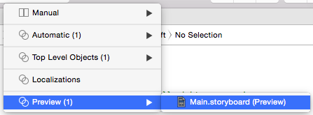

* Pincha sobre el botón + que aparece en la pantalla inferior y elige un iphone \(cualquier tamaño\)
* Repite el proceso y elige un iPad
* Arrastra un `UILabel` a la vista principal y suéltala por el centro de la vista.
* Ajusta las opciones de _autolayout_ para la imagen. Si no controlas _autolayout_ todavía, puedes seleccionar el triángulo de la parte inferior  \(_Resolve autolayout issues_\) y elegir _Reset to suggested constraints_.
* Si mueves el `UILabel` a otra posición, verás que no se actualiza en la ventana de la derecha. Esto es porque todavía tiene los constraints que hemos puesto anteriormente. Para actualizar la vista, pincha de nuevo en el triángulo y selecciona _Update constraints_.
* En la pantalla de la derecha podrás ver cómo queda la vista tanto en iPhone como en iPad.

Puedes ampliar o reducir los _previews_ de la misma manera que se amplía o reduce el storyboard, y quitarlos con la tecla de borrado del Mac. También puedes rotar los dispositivos, pinchando sobre el icono que aparece a la izquierda de sus nombres.

En principio es sencillo. Lo complicado es saber cómo ajustar las _constraints_ y manejar _autolayout_. Las opciones de _autolayout_ pueden parecer fáciles de interpretar, pero a la hora de la verdad no es fácil dejar una vista como queremos.

## Vistas dependientes del dispositivo

A veces nos interesará tener vistas separadas para distintos tamaños, de forma que podamos aprovechar mejor la pantalla. Como se ha mencionado anteriormente, se recomienda usar interfaces diferenciados, ya que simplemente escalar el tamaño de los componentes para pantallas más grandes no suele quedar bien.

A nivel de diseño de interfaz, en lugar de distinguir entre iPhone e iPad, Apple introdujo en XCode 7 el concepto de _size clases_. La idea principal es que debemos pensar el diseño para dos tamaños:

* **Compact**: Cuando tenemos un tamaño _Compact_ debemos hacer un interfaz mínimo que muestre sólo la información principal de forma compacta.
* **Regular**: En un tamaño _Regular_ podemos añadir más elementos y hacer un interfaz más completo, ya que dispondremos de espacio en la pantalla.

Además, estos tamaños pueden ser para la anchura \(_Width_\) o la altura \(_Height_\). Si abrimos el _storyboard_ y pinchamos en la parte inferior sobre _View as: iPhone 8 \(wC hR\)_ podremos ver que se muestran iPhones y iPads de distintos tamaños.

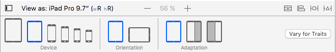

Tal como se muestra en esta imagen, debemos tener en cuenta estos tres factores:

* **Dispositivo**. iPhone o iPad.
* **Orientación**. Vertical u horizontal
* **Adaptación**. Pantalla completa o sólo una parte.

Los valores `wR` y `hR` representan _Regular Width_ y _Regular Height_. Básicamente \(aunque en realidad es algo más complicado\), los dispositivos de Apple tienen los siguientes tamaños:

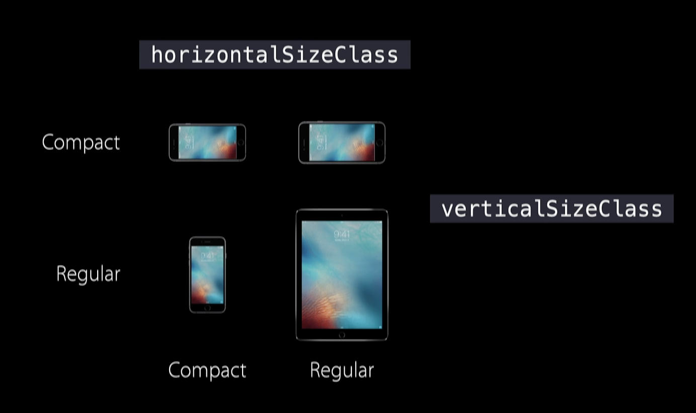

En esta imagen, el iPhone que se ve en arriba a la derecha es un iPhone 6s/7s **plus** \(o iPhone X\), que se consideran de forma especial porque son más grandes que el resto de iphones y por tanto tienen un tamaño regular cuando el móvil está apaisado. Tal como puedes ver, un iPhone normal es `wC-hR` en _portrait_, y `wC-hC` cuando está rotado \(_landscape_\).

> Es importante tener en cuenta que **no siempre un iPad tiene tamaño** _**Regular**_, ya que por ejemplo nuestra app podría mostrarse en un iPad en una zona compacta de la pantalla en lugar de usar la pantalla completa.

En la ventana inferior de _XCode_ podemos cambiar el tipo de dispositivo, su orientación, y en el caso del iPad, su adaptación. Independientemente de lo que seleccionemos, los cambios que hagamos aquí sobre la vista se aplicarán a **todos** los dispositivos.

Sin embargo, si pulsamos sobre el botón _Vary for Traits_ y marcamos _width_, _height_ o ambos, la barra cambiará a color azul para avisar de que los cambios que hagamos a la vista **sólo se van a aplicar para algunos dispositivos**.

Antes de pulsar sobre _Vary for Traits_, lo que tengamos seleccionado en _Device_, _Orientation_ y, en su caso, _Adaptation_, infuirá en las variaciones _width_ o _height_. Por ejemplo, si seleccionamos un iPhone 6s en orientación _portrait_ \(`wC-hR`\) y pulsamos sobre _Vary for Traits &gt; width_, veremos que se muestran todos los dispositivos con _Compact width_, ya que es el ancho que tiene este modelo. Si también marcamos _height_, se mostrarán todos los dispositivos con _Compact width_ y _Regular height_.

Cuando la barra inferior está de **color azul** significa que los componentes que añadamos a la vista o las modificaciones que indiquemos **sólo** se aplicarán a algunos dispositivos en algunas orientaciones.

> Si quieres saber más sobre _size classes_ y _traits_, [este video](https://developer.apple.com/videos/play/wwdc2014/216/) es una buena ayuda. Si lo que quieres es saber cómo trabajar con los _Size Classes_ en XCode8, puedes ver [este video oficial de Apple](https://developer.apple.com/videos/play/wwdc2016/222/), y a continuación [su segunda parte](https://developer.apple.com/videos/play/wwdc2016/233/).

Vamos a ver un ejemplo de lo que se puede hacer con los _Size Classes_:

* Selecciona en la barra de abajo un iPhone SE en orientación apaisada \(`wC-hC`\).
* Si el proyecto no tenía ya un `UILabel`, añádelo a la vista del _storyboard_ y llámalo `Etiqueta`.
* Pulsa sobre el botón `+` a la izquierda de la propiedad _Font_ de la etiqueta, en el _Attributes Inspector_, y luego en _Add variation_, dejando _width=Compact_ y _height=Compact_.
* Fíjate en que aparece una nueva columna en la tabla de propiedades. Puedes cambiar ahí la fuente a 20 puntos, y esto sólo se verá en los dispositivos `wC-hC`.
* Como puedes ver, muchas propiedades tienen el botón `+` para hacer cambios sólo en ciertos tamaños. Si quieres eliminar una propiedad, puedes pulsar sobre el botón `x` que aparece al lado de ella.
* Pulsa ahora en _Vary for Traits_, marca _width_ y también _height_ . Verás que la barra cambia a color azul.
* Añade otra etiqueta, y llámala por ejemplo `Segunda etiqueta`. Fíjate en el _preview_: Esta etiqueta sólo debe aparecer en el _preview_ para iPhones apaisados.
* Pulsa _Done Varying_ en la barra inferior para terminar.

## Ejercicio 2: Ejemplo de app universal \(1\)

Vamos a programar un ejemplo de aplicación universal con algunas vistas comunes y otras diferenciadas en función del tamaño. Cuando tengamos la versión final del programa, en la vista maestra aparecerá un listado de títulos de películas y la vista detalle mostrará los detalles de la película seleccionada, con el título, un texto descriptivo, el año y una imagen.

Para empezar vamos a crear un nuevo proyecto llamado `ejercicio_universal` con la plantilla **Master-detail App**. Compila el código y ejecútalo, añadiendo pulsando al botón de añadir para probar el resultado. Verás cómo cambian la vistas en un iPad cuando la rotamos. Revisa el código para intentar entender el funcionamiento de esta plantilla y si tienes alguna duda pregunta al profesor.

En el método `viewDidLoad` del controlador `MasterViewController`, comentamos las líneas que añaden el botón `addButton`, ya que no vamos a usarlo. También borraremos el método `insertNewObject`, porque no necesitaremos esta opción.

Vamos a empezar con el modelo de datos, creando una nueva clase `Pelicula` mediante _File &gt; New &gt; File &gt; Swift file_:

```swift
import UIKit

class Pelicula {
    var titulo : String
    var caratula : String
    var fecha : String
    var descripcion : String?

    init(titulo: String, caratula: String, fecha: String, descripcion: String?) {
        self.titulo = titulo
        self.fecha = fecha
        self.caratula = caratula
        self.descripcion = descripcion
    }
}
```

En `MasterViewController` sustituimos el array _objects_ que ha creado la plantilla por un array de Películas:

```swift
var objects = [Pelicula]()
```

Vamos a añadir a la tabla una película de ejemplo. Para ello creamos el método `crearListaPeliculas` en la clase `MasterViewController`:

```swift
func crearPeliculas() {
    let sentidoDeLaVida = Pelicula(titulo: "El sentido de la vida", caratula: "sentido.jpg", fecha: "1983", descripcion: "Conjunto de episodios que muestran de forma disparatada los momentos más importantes del ciclo de la vida. Desde el nacimiento a la muerte, pasando por asuntos como la filosofía, la historia o la medicina, todo tratado con el inconfundible humor de los populares cómicos ingleses. El prólogo es un cortometraje independiente rodado por Terry Gilliam: Seguros permanentes Crimson.")

    self.objects.append(sentidoDeLaVida)
}
```

Añadimos una llamada a este método al final de `viewDidLoad`.

Cambiamos también las siguientes lineas en el método `cellForRowAt` para mostrar en las celdas el título de la película:

```swift
let object = objects[indexPath.row]
cell.textLabel!.text = object.titulo
```

Nos sale un _warning_ porque falta cambiar la siguiente línea en el método `prepare` para indicar que no vamos a trabajar con un `NSDate` \(que viene por defecto en la plantilla\):

```swift
let object = objects[indexPath.row]
```

En `DetailViewController`, también tenemos que cambiar estos métodos para trabajar con `Pelicula` en lugar de `NSDate`:

```swift
func configureView() {
     // Update the user interface for the detail item.
     if let detail = self.detailItem {
         if let label = self.detailDescriptionLabel {
             label.text = detail.titulo
         }
     }
}

var detailItem: Pelicula? {
    didSet {
        // Update the view.
        self.configureView()
    }
}
```

Ejecutamos el programa en un iPad, debería mostrar una película \(sólo el título, ya que no hemos añadido la imagen ni otros datos\) y funcionar correctamente.

Vamos a diseñar la vista detalle de manera independiente en función del tamaño del dispositivo, pero antes añadiremos los elementos comunes a todos los dispositivos.

Selecciona la vista detalle en el _storyboard_ y abre con el asistente una segunda ventana para ver el _preview_. Los cambios que vayamos a hacer aquí se aplicarán a todos los dispositivos y tamaños.

Cambia el título de la barra `Detail` por `Película`.

Haz que la vista sea como la siguiente, añadiendo un `UILabel`, un `UIImageView` y `UITextView`:

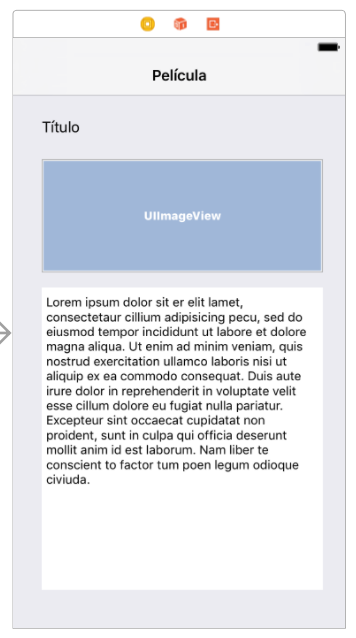

La etiqueta `Titulo` es la que teníamos en el centro, que debes mover a la parte superior izquierda.

Tras colocar los elementos, usa _Reset to suggested constraints_ para que los _constraints_ se ajusten de forma automática. Por si acaso, prueba en la barra de abajo \(_View as:_\) con otros dispositivos y orientaciones, o mira cómo quedan con el _Preview_ \(aunque aquí puede que las vistas no salgan bien por los bugs de _XCode8.0_ anteriormente mencionados\). No debería dar _warnings_ de _constraints_, pero si te salen ajusta las _constraints_ para arreglarlos \(es importante no dejar _warnings_ en esta fase\).

Conecta todos los elementos de la vista al controlador `DetailViewController`: El `titulo`, `imagen` y `descripcion`. También añadiremos la fecha, pero esto será más adelante ya que sólo queremos verla en iPad y esta es la vista general para todas las plataformas.

> Para saber cómo quedan las vistas antes de ejecutar el simulador, puedes usar la vista preview del storyboard.

Cambia el siguiente método en `DetailViewController` para asignar los valores del modelo a la vista:

```swift
    func configureView() {
        // Update the user interface for the detail item.
        if let detail = self.detailItem {
            if let label = self.titulo {
                label.text = detail.titulo
            }
            if let imagen = self.imagen {
                imagen.image = UIImage(named : detail.caratula)
            }
            if let descripcion = self.descripcion {
                descripcion.text = detail.descripcion!
            }
        }
    }
```

Necesitarás descargar [esta imagen](https://github.com/mastermoviles/interfaz-de-usuario-en-dispositivos-moviles-ios-a/tree/b1925b63c84bda8abfc2ae116a76afb1d085e88d/sesion3_componentes_para_ipad_y_aplicaciones_universales/sentido.jpg) y arrastrarla a los _Assets_.

Por último, en las propiedades del `UIImageView` cambia el `ContentMode` a `Aspect Fit` para que la imagen no se deforme:

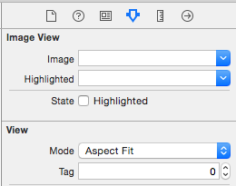

Ejecuta el programa con el simulador de distintos iphone e ipad para ver los resultados. Seguro que visualmente no queda demasiado bien, pero de momento no es un problema. Vamos a ajustar mejor la vista en función del dispositivo, y a poner la fecha sólo en el ipad.

#### Vista de iPhone \(portrait y landscape\)

Empezaremos con el diseño para tamaños compactos. Si ejecutamos el programa en un iPhone en _landscape_, veremos que la imagen ocupa casi toda la pantalla y deja poco espacio para el texto. Lo ideal sería que la imagen estuviera a la izquierda y el texto a la derecha.

Una opción para hacer esto sería seleccionar un iPhone apaisado, y marcar _Vary for Traits_ para _width_ y _height_. A continuación podríamos cambiar las vistas de posición, poniendo una a la izquierda y otra a la derecha, y ajustar las _constraints_ sólo para estos tamaños. Esto sería correcto, pero el problema es que no siempre que tengamos `wC-hC` significará que haya más espacio horizontal que vertical. Existe una solución más limpia: usar _Stacks_ para agrupar las vistas y gestionar los giros.

Deja _Vary for Traits_ desmarcado \(la barra inferior no debe estar en azul\), y selecciona el `UIImageView` y el `UITextView`. Ahora pulsa sobre el elemento _Stack_, el primer icono de esta imagen:

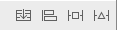

Verás que las vistas se unen, esto es porque hemos creado un grupo con dos elementos. Como ves, un _Stack_ se usa para agrupar vistas, y nos permite realizar acciones interesantes como vamos a ver a continuación. Vamos a reajustar las _constraints_ con este nuevo _Stack_, seleccionando _Reset to suggested constraints_ para toda la vista detalle.

Si ejecutamos el programa, el aspecto será más o menos como el que teníamos antes. Vamos a arreglar el tema del giro, ya que cuando ponemos un iPhone en _landscape_ no se visualiza bien la película. Para ello, necesitamos conectar nuestro _Stack View_ a `DetailViewController`. Llámalo `stackView`:

```swift
@IBOutlet weak var stackView: UIStackView!
```

Ahora vamos a añadir el siguiente método en `DetailViewController`:

```swift
override func viewWillLayoutSubviews() {
    if view.bounds.size.width >= view.bounds.size.height {
        self.stackView.axis = .horizontal
    }
    else {
        self.stackView.axis = .vertical
    }
}
```

Este método se invoca cuando iOS detecta que hay que reajustar las vistas \(por ejemplo cuando se realiza un giro\). En el código indicamos que cuando tengamos más espacio horizontal que vertical nuestras vistas del _stack_ deben reposicionarse. Además, lo harán con una animación. Prueba a ejecutar de nuevo el programa en un iPhone, debe verse así en _portrait_:

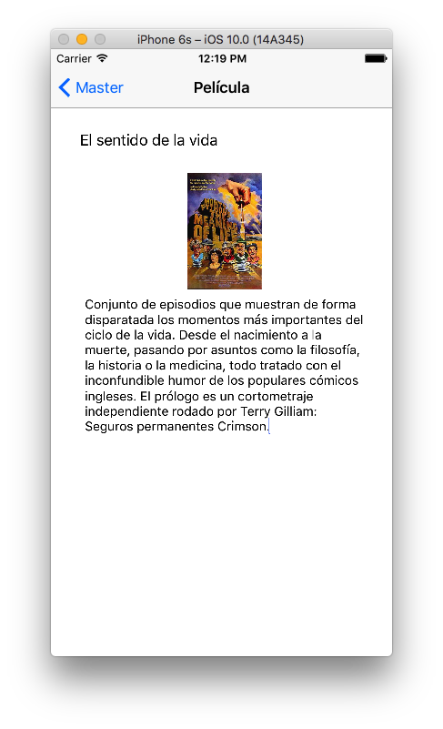

Y así en _landscape_:

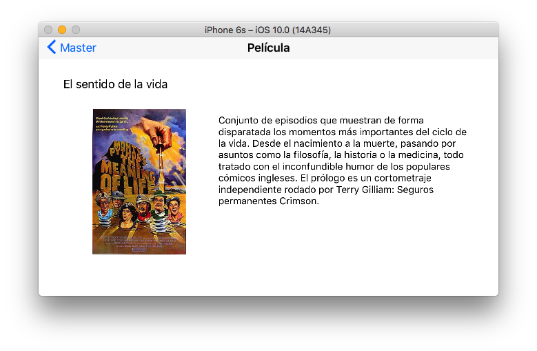

Para saber más sobre lo que podemos hacer con la clase `UIStackView`, puedes consultar su referencia [aquí](https://developer.apple.com/reference/uikit/uistackview).

#### Vista de iPad \(portrait y landscape\)

Vamos a ajustar el _constraint_ de la altura de la imagen para hacerla más grande en tamaños `wR-hR`, ya que en estos casos tenemos más espacio.

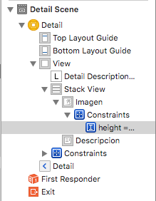

Ahora pulsamos sobre el botón `+` de la altura, añadiendo una variación para `wR-hR`:

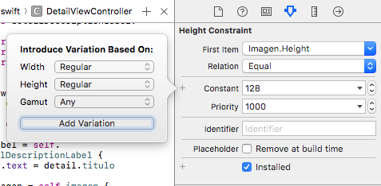

Y finalmente indicamos un valor más alto:

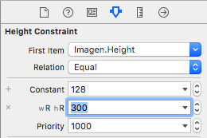

Ejecutamos el programa y vemos que funciona correctamente en iPad, en cualquier orientación. Ahora vamos a cambiar el tipo de letra para `wR-hR`, de forma que se vea más grande en un iPad. Cambia sólo para tamaños `wR-hR` la fuente del texto a _System-20_, y la del título a _System-22_ y en negrita:

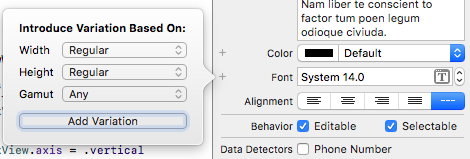

Ahora vamos a añadir una etiqueta que contenga la fecha, pero sólo en aquellos casos en los que tengamos suficiente espacio en anchura, en orientaciones regular width: `wR`.

Seleccionamos un iPad en la barra inferior del _storyboard_, e indicamos _Vary for traits &gt; width_. La barra debe cambiar a color azul. Añadimos un _UILabel_ arriba a la derecha, al que pondremos el título _Fecha_, como puede verse en la siguiente imagen:

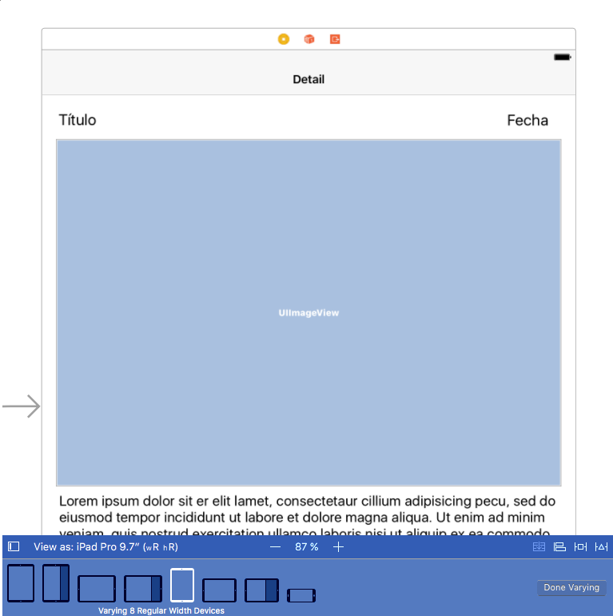

Cuando el ancho es _Regular_ tenemos más espacio, es por esto que lo añadimos aquí. Esta etiqueta sólo se mostrará en los iPad cuando nuestra app esté a pantalla completa en cualquier orientación, o en el iPhone 6s/7 Plus con pantalla completa y _landscape_.

> **Muy importante:** En XCode8, cuando está activado _Vary for traits_ **si se usa** _**Reset to Suggested constraints**_ **los cambios se aplicarán a las vistas de todos los tamaños, no sólo de los seleccionados**, a pesar de estar la barra en azul. Si cambiamos las _constraints_ como hemos visto antes sólo se aplicarán a las vistas del tamaño seleccionado. Asimismo, si **movemos** una vista o **cambiamos** uno de sus atributos directamente desde el Storyboard con la barra en azul, en XCode 8.0 se cambiará a **todos** los tamaños, no sólo para el actual. Esto último es un bug que está arreglado en XCode 8.1.

Conectamos el `UILabel` al controlador y llamamos a la variable `fecha`. Añadimos lo siguiente a `configureView`:

```swift
  if let fecha = self.fecha {
          fecha.text = detail.fecha
  }
```

Ejecutamos el código en el simulador de iPad para ver los resultados. Deberíamos obtener algo parecido a esto:

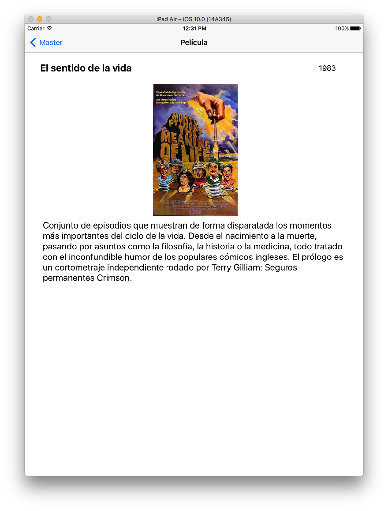 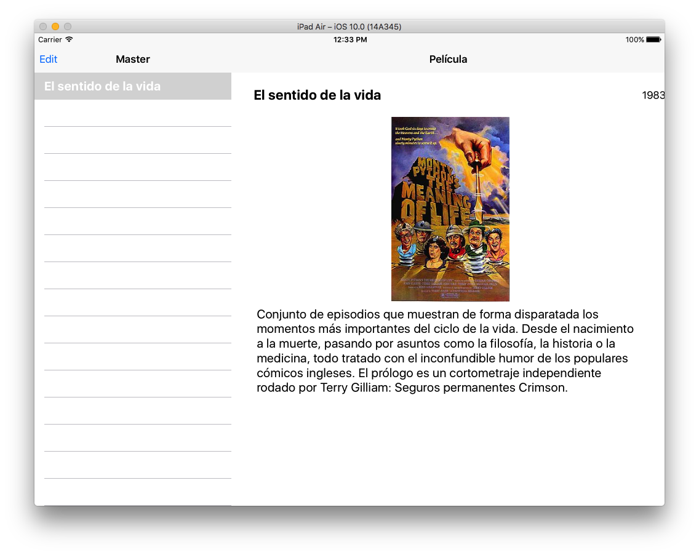

El aspecto no está mal, pero sólo es una primera aproximación. Vamos a mejorar un poco el programa en el siguiente ejercicio.

## Ejercicio 3 - Ejemplo de app universal \(2\)

Haz una copia del proyecto de ejemplo anterior para conservarlo antes de los cambios, y llama al nuevo `ejercicio_peliculas`. Usaremos como base este proyecto, sobre el cual debemos hacer las siguientes mejoras:

* Completa el modelo añadiendo dos películas más \(con sus imágenes\) al proyecto, las que prefieras.
* Vamos a mejorar la presentación visual. Para ello cambia el título de la barra de la vista detalle, de _Película_ al título de la película seleccionada en la vista con el año entre paréntesis. Por ejemplo, en la barra superior debería salir _El sentido de la vida \(1983\)_. Elimina los `UILabel` del título y de la fecha, ya que esta información se va a mostrar ahora en la barra superior.
* Cambia el aspecto gráfico de las vistas para que queden lo mejor posible. Puedes mover los objetos, redimensionarlos o modificar sus propiedades, por ejemplo. Cambia el `UITextView` para que no sea editable mediante sus propiedades en el _storyboard_.
* La primera vez que aparece la aplicación en iPad en portrait \(sin llegar a seleccionar una película\) sale la vista detalle con información vacía. Haz que en este caso se muestre sólo `Película` en la barra del título, y que la descripción sea el mensaje _Selecciona una película_.
* \(opcional\) Por último, añade una lista de actores para cada película mediante un array. En los iPad debe poder verse esta información mediante un _popover_ mostrando un actor por cada opción del desplegable, aunque sin hacer ninguna acción cuando se pulse, sólo cerrar el _popover_. Para ello tendrás que crear un botón en la barra de navegación \(ojo, debe ser un `UIBarButtonItem` en lugar de un botón normal\), que muestre el popover cuando se pulse. En los iphone **no** debe mostrarse la información de los actores.

